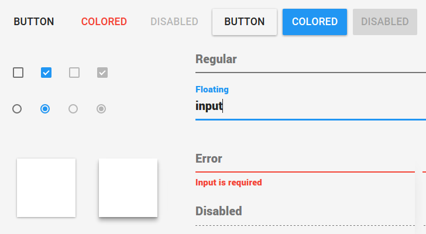

# Zorium Paper

#### Material design components for the [Zorium](https://zorium.zolmeister.com) framework

[](https://zorium.zolmeister.com)

### Documentation

[zorium.org/paper](https://zorium.zolmeister.com/paper)

### Install

```bash
npm install -S zorium-paper
```

Use these webpack loaders

```coffee
{ test: /\.coffee$/, loader: 'coffee' }
{ test: /\.json$/, loader: 'json' }
{
  test: /\.styl$/
  loader: 'style!css!autoprefixer!stylus?' +
          'paths[]=bower_components&paths[]=node_modules'
}
```

### Usage

```coffee
Button = require 'zorium-paper/button'
paperColors = require 'zorium-paper/colors.json'
$button = new Button()

z $button,
  text: 'click me'
```
